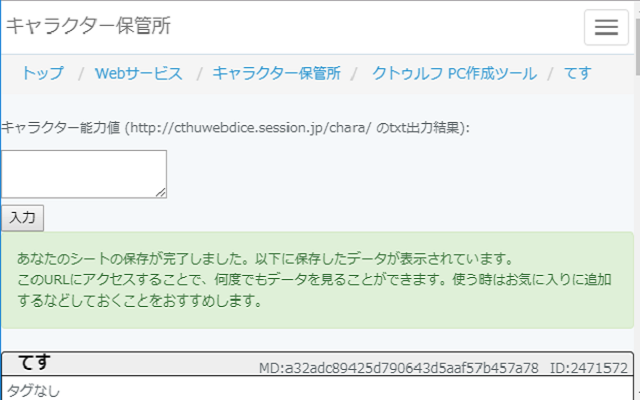

# charactor status input

キャラクターの能力値(txt形式)をキャラクターシートに入力する。

CoCのキャラクターを作成するページで作成したキャラクターの能力値をキャラクターシートに転記できるため、入力の手間を省略できる。

この拡張機能をインストールすると、
キャラクターシートのページの上部に能力値を入力する欄とボタンが追加される。
作成したキャラクターの能力値をテキスト形式で出力したものを入力欄に張り付けてボタンを押せば、
キャラクターシートに能力値が転記される。

キャラクターを作成するページ：http://cthuwebdice.session.jp/chara/
キャラクターシート：https://charasheet.vampire-blood.net/coc_pc_making.html

